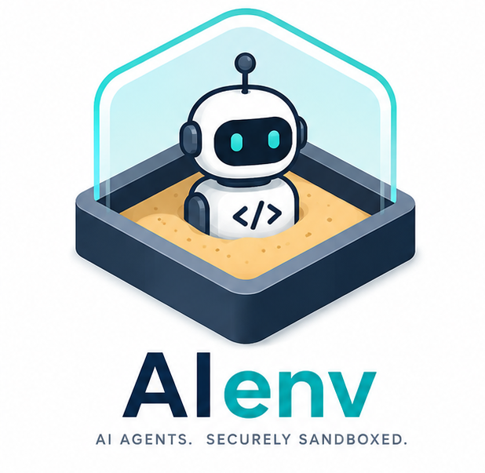

# 🔒 aienv

<p align="center">
  
</p>

> Secure sandboxes for AI coding agents — like `virtualenv` for AI.

**Bring your own agent.** aienv provides the sandbox, isolation, and audit trail.

AI coding setups are chaotic. Different projects need different tools, credentials, and configs. **aienv** brings order with:
- 🐳 **Isolated Docker sandboxes** — agents run in containers, not your host
- 🚫 **Network enforcement** — whitelist APIs with learn mode for suggestions
- 📝 **Complete audit trails** — JSONL logs of all commands and network calls
- ⚙️ **Black-box agent design** — works with OpenCode, Claude Code, Cursor, or any CLI agent
- 🔑 **Permission control** — mount selectively, run read-only by default
- 🚀 **Session isolation** — each `aienv up` is a fresh, independent container

```bash
# Install
go install github.com/kapilratnani/aienv@latest

# Create an isolated environment for Claude Code
aienv create claude-dev

# Launch the agent in sandbox with access to TUI
aienv up claude-dev

# Send a prompt directly with no access to TUI (one-shot mode. Agent does the job and exits)
aienv up claude-dev -p "Refactor the auth module to use JWT and create the PR using gh cli" -x
```

---

## ⚡ Quick CLI Reference

| Command | Description |
|---------|-------------|
| `aienv create <name>` | Interactive environment setup |
| `aienv up <name>` / `aienv <name>` | Launch sandbox (auto-builds image) |
| `aienv up <name> -p "prompt"` | Send prompt to agent |
| `aienv up <name> -p "prompt" -x` | One-shot: run and exit |
| `aienv up <name> -w <branch>` | Create git worktree and activate |
| `aienv list` | Show all environments |
| `aienv show <name>` | Inspect environment config |
| `aienv edit <name>` | Edit YAML in `$EDITOR` |
| `aienv build <name>` | Force rebuild Docker image |
| `aienv shell <name>` | Debug shell inside sandbox |
| `aienv delete <name>` | Remove env + image + audit logs |
| `aienv clean` | Remove orphaned resources |

---

## 📋 Configuration Schema

Define an environment entirely in YAML:

```yaml
env:
  name: claude-dev
  description: Sandboxed Claude Code for projects

agent:
  install:
    - npm install -g @anthropic-ai/claude-code
  command: [claude]
  env:
    ANTHROPIC_API_KEY: "env:ANTHROPIC_API_KEY"  # passthrough from host
    GITHUB_TOKEN: "env:GITHUB_TOKEN" # to create pr after the work is done
  mounts:
    - source: ~/projects/my-app
      target: /workspace
      writable: true
    - source: ~/.claude
      target: ~/.claude
      writable: true

deps:
  packages: [nodejs, git, curl]
  custom: [go install foo/bar@latest]

permissions:
  network:
    allow: [api.anthropic.com, raw.githubusercontent.com]
    deny: ["*"]

audit:
  persist: true
  capture: [network]
```

---

## 📚 Ready-to-Use Recipes

### 🌻 Start Simple
```yaml
env:
  name: my-coding-env
  description: coding env for my project

agent:
  install:
    - npm install -g opencode-ai
  command:
    - opencode
  env:
    - GITHUB_TOKEN: "env:GITHUB_TOKEN"
  mounts:
    - source: /path/to/your/project
      target: /workspace
      writable: true
```

invoke to work with TUI

```bash
$ aienv up my-coding-env
```

One shot mode with a prompt. Does the job and exits.
```bash
$ aienv up my-coding-env -p "fix login bug in github issue #12 and create pr. Use gh cli" -x
```

### 🔧 Claude Code

```yaml
env:
  name: claude-dev
  description: Sandboxed Claude Code

agent:
  install:
    - npm install -g @anthropic-ai/claude-code
  command: [claude]
  env:
    ANTHROPIC_API_KEY: "env:ANTHROPIC_API_KEY"
  mounts:
    - source: /home/you/projects/my-app
      target: /workspace
      writable: true
    - source: ~/.claude
      target: ~/.claude
      writable: true
    - source: ~/.agents/skills/caveman
      target: ~/.agents/skills/caveman
    - source: ~/.agents/skills/agent-browser
      target: ~/.agents/skills/agent-browser

permissions:
  network:
    allow: [api.anthropic.com, raw.githubusercontent.com]

audit:
  persist: true
  capture: [network]
```

**Launch it:**
```bash
aienv up claude-dev
aienv up claude-dev -p "Refactor auth module to use JWT" # with TUI
# or
aienv up claude-dev -p "Refactor auth module to use JWT. create pr with gh cli" -x
```

### 🎯 OpenCode 

```yaml
env:
  name: opencode-dev
  description: Develop with OpenCode

agent:
  install:
    - npm install -g opencode-ai
  command: [opencode]
  prompt_flag: "--prompt" # optional - if agent has a custom flag for initial prompt
  exit_subcommand: "run" # optional - subcommand for one shot mode
  args: [--model, opencode/deepseek-v4-flash-free]
  mounts:
    - source: /home/you/projects/aienv
      target: /workspace
      writable: true
    - source: ~/.config/opencode
      target: ~/.config/opencode
      writable: true

deps:
  packages: [golang-go]

audit:
  persist: true
  capture: [network]
```

### 🤖 Pi

```yaml
env:
  name: pi-dev
  description: Sandboxed Pi coding agent

agent:
  install:
    - npm install -g @earendil-works/pi-coding-agent
  command: [pi]
  env:
    ANTHROPIC_API_KEY: "env:ANTHROPIC_API_KEY"
  mounts:
    - source: /home/you/projects/my-app
      target: /workspace
      writable: true

deps:
  packages: [nodejs, git, curl, ripgrep]

audit:
  persist: true
```

### 🎨 Bring Your Own

Any CLI-based agent works — just change `agent.install` and `agent.command`. Zero code changes.

---

## 🎯 Key Features

| Feature | Benefit |
|---------|---------|
| **Black-box agents** | Works with any CLI agent — OpenCode, Claude Code, Cursor, Pi, or your own |
| **Content-addressed images** | Docker images auto-generated from YAML, cached by hash, rebuilt on config change |
| **Network proxy** | HTTP/HTTPS proxy with allow/deny/learn modes running on host. Learn mode suggests an allowlist. |
| **Audit logging** | JSONL session records of all commands and network requests at `~/.local/share/aienv/<name>/audit/<session-id>/` |
| **Trust system** | First activation shows mounts + network rules, asks for confirmation, caches by env hash |
| **Session isolation** | Each `aienv up` spawns a fresh container with unique session ID. Concurrent activations are independent. |
| **Git worktree support** | `aienv up -w <branch>` creates a worktree, mounts it into sandbox, cleans up on exit |
| **Debug shell** | `aienv shell <name>` drops into `/bin/bash` inside sandbox without the agent |
| **XDG-compliant** | Config at `~/.local/share/aienv/`, trust cache at `~/.config/aienv/trust/` |

---

## 🏗️ How It Works

```
┌────────────────────────────────────────────────────────────┐
│ $ aienv up my-env                                          │
│                                                            │
│ 1️⃣  Load ~/.local/share/aienv/my-env/env.yaml             │
│ 2️⃣  Compute SHA-256 hash → check Docker image cache       │
│ 3️⃣  Auto-generate & build Dockerfile if missing           │
│ 4️⃣  Start network proxy on random host port               │
│ 5️⃣  Spawn container with:                                 │
│     • Project + config mounts (read-only by default)      │
│     • HTTP_PROXY pointing at host proxy                   │
│     • Audit dir mounted at /aienv/audit                   │
│     • Agent command as entrypoint                         │
│ 6️⃣  Agent runs inside container                           │
│     • All network traffic filtered through proxy          │
│     • Audit logs written in real-time                     │
│ 7️⃣  On exit:                                               │
│     • Container auto-removed                              │
│     • Proxy stopped                                        │
│     • Audit logs persisted                                │
└────────────────────────────────────────────────────────────┘
```

---

## 🔍 Project Structure

```
aienv/
├── cmd/              # CLI commands (create, up, list, edit, etc.)
├── internal/         # Core logic (unexported packages)
│   ├── audit/        # JSONL audit log schema & writer
│   ├── config/       # XDG paths, hashing, session IDs
│   ├── docker/       # Docker build, run, proxy, trust
│   └── env/          # Env struct, YAML load/save/validate
├── docs/             # Architecture, roadmap, ADRs
├── CONTEXT.md        # Domain glossary
└── Makefile          # Build, test, lint, coverage
```

---

## 🚀 Development

```bash
# Build
make build

# Test with coverage
make coverage

# Run with race detector
make test-race

# Format & lint
make fmt
make vet
```

---

## 💡 When to Use aienv

✅ **Use aienv when:**
- Running untrusted or experimental AI agents
- Isolating agents across different projects
- Enforcing network policies (which APIs can agents call?)
- Keeping detailed audit trails for compliance
- Working with multiple AI tools (Claude, OpenCode, Codex)
- Testing agents without risking your host

---

## 📖 Documentation

- **[Architecture](docs/architecture.md)** — System design & data flow
- **[Roadmap](docs/roadmap.md)** — Planned features
- **[Domain Context](CONTEXT.md)** — Glossary of terms
- **[ADRs](docs/adr/)** — Architecture Decision Records

---

## 🤝 Contributing

We welcome PRs, issues, and ideas! For larger changes, please open a discussion first.

---

## 📄 License

MIT — See [LICENSE](LICENSE) for details.

---

## ✨ Why aienv?

- **Control**: Choose which APIs your agents can access
- **Visibility**: Audit everything agents do
- **Isolation**: No pollution across projects or host system
- **Flexibility**: Works with any CLI agent
- **Simplicity**: One YAML file per environment

Start sandboxing today:

```bash
go install github.com/kapilratnani/aienv@latest
aienv create my-env
aienv up my-env
```
