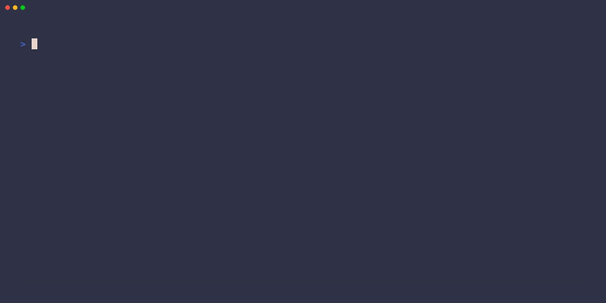

# 🚀 aienv

> Reproducible, isolated environments for AI coding agents.

Run AI coding agents inside project-scoped environments with only the MCPs, skills, rules, and tools your project needs.

Think:
- 🐍 `virtualenv` for AI agents
- 🐳 Docker for coding workflows
- 🧠 reproducible AI development environments

---

## ✨ Why aienv?

AI coding setups become chaotic surprisingly fast.

Different projects need different:
- MCP servers
- prompts/rules
- coding skills
- model providers
- API credentials
- tooling stacks

Today most developers manage this with:
- copied config files
- hidden editor state
- global MCP installs
- shell scripts
- README instructions

This quickly becomes:
- ❌ unreproducible
- ❌ hard to share
- ❌ insecure
- ❌ difficult to debug
- ❌ full of tool conflicts

`aienv` fixes this by creating:

✅ isolated AI environments  
✅ reproducible coding workflows  
✅ project-scoped MCPs and skills  
✅ disposable Docker sandboxes  

---

# 🎥 Demo

## Local Environment

```bash
aienv backend-api
```

👉 Opens the configured agent (OpenCode or Claude Code) with:
- project MCPs
- coding skills
- rules
- model config
- environment variables

loaded automatically.


---

## Docker Sandbox

```bash
aienv --docker backend-api
```

👉 Runs the agent inside an isolated Docker container:
- disposable runtime
- isolated dependencies
- sandboxed MCP execution
- scoped filesystem access



---

# 🔥 Core Features

## 🧠 Project-Scoped AI Environments

Each project gets its own:
- MCP servers
- prompts/rules
- skills
- models
- credentials

No more global AI configuration chaos.

---

## 🎯 Multi-Agent Support

Choose your agent per environment — OpenCode or Claude Code.

```bash
aienv create my-env
# → Select agent: opencode / claude-code
```

Each agent gets correctly-formatted config:
- **OpenCode**: `opencode.json` with `mcp.<name>.command` array
- **Claude Code**: `mcp-config.json` with `mcpServers.<name>.command` string + `args` array

Skills scoped per agent, isolation via `CLAUDE_CONFIG_DIR` for Claude Code.

---

## 💬 Starter Prompts

Inject a default starter prompt into every session to guide agent behavior.

Set a persistent prompt in `ai-env.yaml`:

```yaml
name: aienv
prompt: Use caveman and tdd skills
```

Override at runtime with `--prompt`:

```bash
aienv --prompt "Be thorough and write tests first" my-env
```

The prompt text is written to `starter-prompt.md` and prepended to the agent's instructions array on every activation. Great for enforcing workflows, personas, token efficiency, or coding standards — for example, the aienv environment itself uses `prompt: Use caveman and tdd skills` to keep every session lean and test-driven.

---

## 🐳 Isolated Docker Execution

Run coding agents in disposable containers.

Perfect for:
- secure execution
- dependency isolation
- reproducibility
- experimenting safely

Everything runs inside the sandbox:
- OpenCode / Claude Code
- MCP servers
- agent shell commands

> **Note:** For OpenCode in Docker mode, only the skills declared in your environment are accessible inside the container (filesystem isolation). Outside Docker, skills are functionally restricted by permissions — they appear in the agent's skills dialog but won't activate by trigger phrases unless explicitly allowed. This is a known behavior of the agent's permission system; your environment-scoped skills still work correctly when invoked.

---

## 🔌 MCP Management

Quickly compose environments using:
- curated MCP registry
- official MCP registry search
- custom MCP servers

Supports:
- npm (`npx`)
- Python (`uvx`)
- Go (`go run`)

---

## 📦 Reproducible AI Workflows

Clone repository → run environment → identical setup.

```bash
git clone my-project
cd my-project

aienv backend-api
```

Works across:
- laptops
- teams
- CI systems
- fresh machines

---

## ⚡ Instant Context Switching

Switch between environments instantly:

```bash
aienv frontend-design
aienv incident-response
aienv trading-research
```

Each environment loads its own:
- skills
- MCPs
- prompts
- credentials

---

# 🏗 Example Environments

## OpenCode

```yaml
name: aienv
agent: opencode
model: opencode/deepseek-v4-flash-free
prompt: Use caveman and tdd skills

mcp:
  github:
    type: local
    command: ["npx", "-y", "@modelcontextprotocol/server-github"]

skills:
  - name: tdd
    source: registry
    package: mattpocock/skills
  - name: caveman
    source: local
    path: ./skills/caveman

rules:
  - path: ./AGENTS.md
```

## Claude Code

```yaml
name: frontend-design
agent: claude-code
model: claude-sonnet-4-5
prompt: Follow the design system and use shadcn components

mcp:
  shadcn:
    type: local
    command: ["npx", "-y", "@shadcn/mcp-server"]

skills:
  - name: frontend-design
    source: registry
    package: anthropics/skills

rules:
  - path: ./docs/design-tokens.md
```

---

# 🚀 Quick Start

## Install

```bash
go install github.com/kapilratnani/aienv@latest
```

Initialize shell integration:

```bash
aienv init
source ~/.zshrc
```

---

## Create Environment

```bash
aienv create backend-api
```

Interactive setup includes:
- agent selection (OpenCode / Claude Code)
- curated MCP selection
- skill selection
- official registry search
- environment validation

---

## Activate Environment

```bash
aienv backend-api
```

---

## Run in Docker Sandbox

```bash
aienv --docker backend-api
```

---

# 🐳 Docker Sandbox

The sandbox provides:
- isolated runtime
- disposable execution
- dependency isolation
- safer agent execution

### Runs inside container
✅ OpenCode / Claude Code  
✅ MCP servers  
✅ shell commands  

### Stays on host
✅ source code  
✅ SSH keys  
✅ orchestration logic  

---

# 🧩 Supported MCP Ecosystem

Supports:
- GitHub
- Slack
- Postgres
- Sentry
- Datadog
- Notion
- Stripe
- Jira
- Brave Search
- and more...

Search directly from:
- Official MCP Registry
- skills.sh

---

# ⚙️ Commands

| Command | Description |
|---|---|
| `aienv create <name>` | Create environment |
| `aienv <name>` | Activate environment |
| `aienv --docker <name>` | Run in Docker sandbox |
| `aienv --prompt <text> <name>` | Activate with custom starter prompt |
| `aienv --model <model> <name>` | Activate with model override |
| `aienv list` | List environments |
| `aienv show <name>` | Show config |
| `aienv edit <name>` | Edit environment |
| `aienv delete <name>` | Delete environment |
| `aienv docker build` | Build sandbox image |

---

# 🧠 Philosophy

AI coding agents are becoming infrastructure.

Infrastructure needs:
- isolation
- reproducibility
- portability
- composability
- security boundaries

`aienv` brings these ideas to AI development workflows.

---

# 🛣 Roadmap

- [x] Create flow with curated & registry search
- [x] Docker sandbox isolation
- [x] Starter prompts
- [x] Claude Code support
- [ ] Docker auth (credential transfer)
- [ ] Repo-local `.aienv.yaml` + `aienv up`
- [ ] Permission policies & trust
- [ ] Agent expansion framework
- [ ] Default environment directory
- [ ] Custom MCP/skill repositories
- [ ] Environment sharing

---

# 🤝 Contributing

Contributions welcome in these areas:

### MCPs
Add curated MCPs to `curated/mcps.yaml` following the existing schema. Include `env[]` metadata for any required environment variables so users are prompted during `aienv create`.

### Skills
Add curated skills to `curated/skills.yaml`. Skills should link to their installed path and include a `description` that helps the create-flow search match user intent.

### New Agents
Agent support is pluggable via `internal/agents/agent.go`. Implement the `Agent` interface (`Name()`, `GenerateFiles()`, `ActivateCommand()`) and register via blank import in `agent_import.go`. See `internal/agents/opencode/gen.go` or `internal/agents/claude/gen.go` for reference.

### General
PRs, issues, and ideas welcome. Open a discussion for larger changes before submitting.

---

# ⭐ Star History

[Add star-history chart here]

---

# 📜 License

MIT
